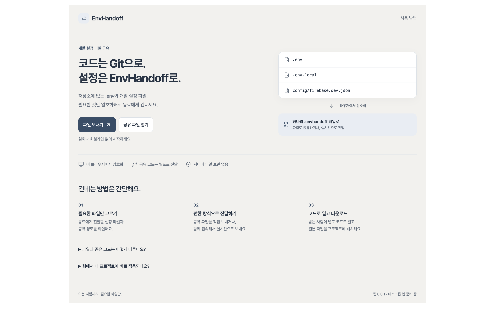
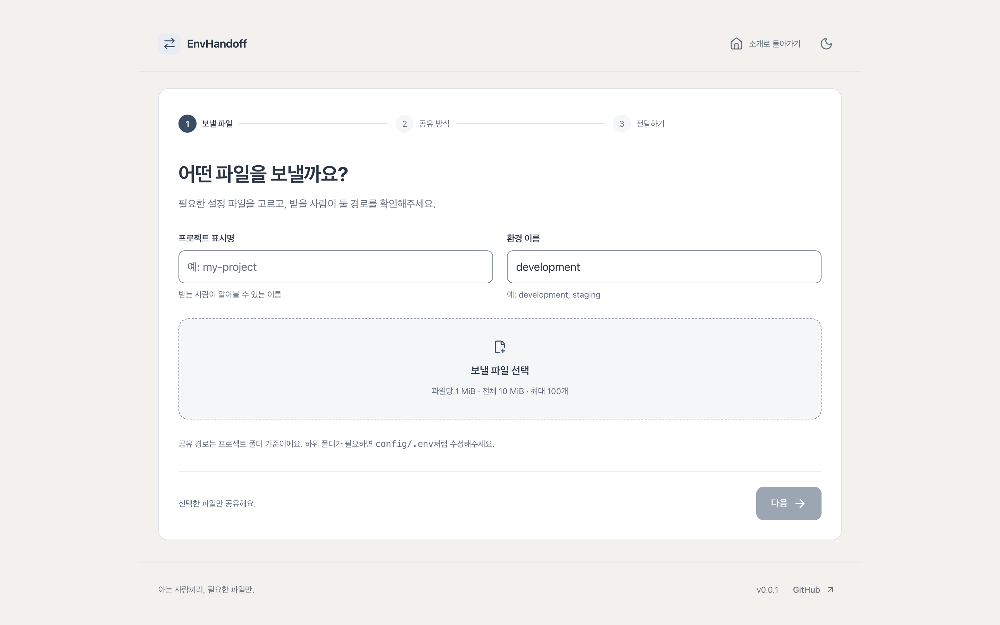
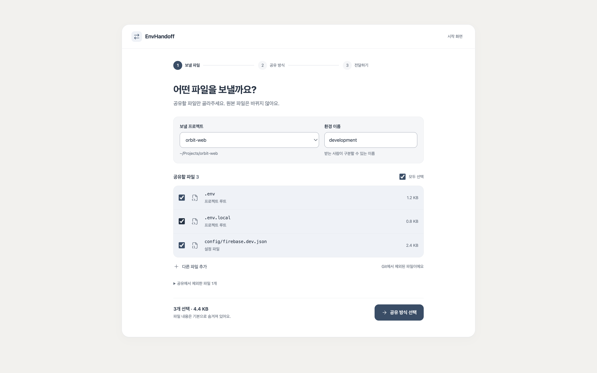
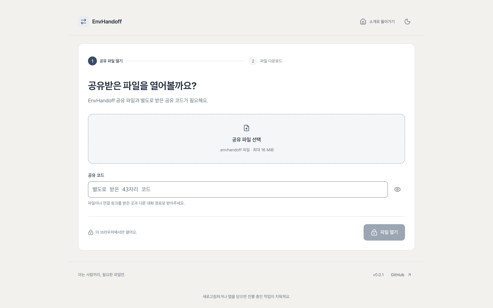

# EnvHandoff

**English** | [한국어](README.ko.md)

**Securely hand off the development settings Git leaves out.**

EnvHandoff encrypts `.env` and other development configuration files for sharing. It bundles the settings a teammate still needs after cloning a repository, preserving each file as it is. The recipient opens the bundle with a separately shared code, extracts the original files, and uses them in their own project.

The web app starts with file sharing and downloads. A planned desktop app will add comparison, application, and recovery within a project folder. The current version is **0.0.1**, with file sharing and live transfer available in local development. The app interface and design documents are currently in Korean.

## Screenshots

Explore the home page, file sharing flow, and desktop project view. Click an image to view it at full size.

| Home | Send |
| :---: | :---: |
| [](docs/images/landing-home.png) | [](docs/images/landing-send.png) |
| **Send (file selection)** | **Receive** |
| [](docs/images/desktop-d-files.png) | [](docs/images/landing-receive.png) |

## When to use it

- Onboard a teammate by sharing Git-ignored `.env`, `.env.local`, and other required configuration files together.
- Share a snapshot of selected files when development settings change.
- Transfer live when both people are online, or leave an encrypted file when their schedules differ.

Each file retains its relative path and original bytes. There is no need to re-enter settings key by key or convert them to a service-specific format. Manually selected JSON and other development configuration files work the same way as `.env` files.

## Two ways to share

| | Shared file | Live transfer |
|---|---|---|
| Best for | People online at different times | Both people online at once |
| What you send | An encrypted `.envhandoff` file | A one-time connection link |
| Delivery | AirDrop, messenger, email attachment, etc. | The relay forwards ciphertext after sender approval |
| Recipient | Opens the file with a separate code | Connects through the link, then opens with a separate code |
| Confirmation | The app cannot tell whether the recipient received it | Confirmed when the receiving app acknowledges ciphertext authentication |

For both methods, **share the code through a different conversation channel from the file or link**. No account is required. The flow assumes people who know each other and can confirm who they are talking to through an existing private conversation.

## Web and desktop

The web app lets people exchange files without installation. The planned desktop app will also let recipients review and apply settings to a local project.

| Capability | Web 0.0.1 — available now | Desktop app — planned |
|---|---|---|
| File selection | Browser file picker, drag and drop, or individual environment variable entry; review and edit shared paths manually | Choose a project folder; inspect configuration candidates and Git status |
| Delivery | Encrypted file sharing and live transfer | Exchange with the web app using the same format and relay |
| Import | Review after authentication and download original files | Choose a destination folder and compare existing files |
| Apply to a project | Place downloaded files manually | Back up selected files, then add or replace them |
| Undo | Does not directly modify project files | Restore the state before import |
| Runtime | Browser; runnable in local development | Planned macOS and Windows app built with Tauri 2 |

The folder selection and application flow is described in the [desktop design](docs/app-design.md).

Continuous file synchronization, team accounts, permissions, and cloud storage are outside the current version. The next steps are testing on separate devices and browsers and exercising public relay failures. The original desktop and team scope is in the [product plan](docs/product-plan.md); a [Pro web design draft](docs/pro-web-design.md) explores delivering Pro in the browser first. The free web app and relay stay on Cloudflare, while the Pro API uses a separate Node server.

## Usage

**Send files**

1. In `파일 보내기` (Send files), select or drag and drop files into the file area. To enter settings individually, enter key/value rows under `환경변수 직접 입력` (Enter environment variables), use `변수 추가` (Add variable) for more rows or remove unwanted rows, then select `.env 파일로 추가` (Add as an .env file). Review the resulting file list and shared paths, and enter a project label and environment name.
2. Choose a shared file or live transfer.
3. For a shared file, download it and send it to the recipient. Share the code through a different conversation channel.
4. For live transfer, send the connection link, compare the confirmation numbers on both screens in a private conversation, and approve the transfer. Share the code separately.

**Receive files**

1. Select `공유 파일 열기` (Open a shared file) on the home page and choose an `.envhandoff` file, or open a connection link you received.
2. Enter the shared code. Once authentication succeeds, review the file list and shared paths.
3. Download the original files you need and place them in your project using the shared paths as a guide. File contents appear only when you select `내용 보기` (View contents).

After a live transfer reaches 100%, the sender waits for receipt confirmation. The receiving app must authenticate the ciphertext and acknowledge it before the sender sees completion. If the connection drops, reconnect with a new link or download the same bundle as a shared file. A completed download or receipt does not mean the files have been applied to a project.

Limits are 100 files, 1 MiB per file, 10 MiB of original file data in total, and 16 MiB for an encrypted shared file. Enter a shared path such as `config/.env` to represent a subfolder. Both creation and opening reject duplicate paths, case collisions, parent traversal, reserved names, and other invalid paths.

## File and code handling

- Uses AES-256-GCM through Web Crypto. Each new bundle gets an independent 256-bit shared code and a 96-bit nonce. Metadata and original file bytes are encrypted together.
- Files, codes, viewed contents, and selections stay in the current tab's memory. They are not restored after a refresh or tab closure. The app uses no analytics SDK, localStorage, IndexedDB, or service worker.
- The relay never receives the shared code. Connection tokens are separate from file decryption keys. Files, ciphertext, and keys are not written to server storage or application logs. Only rate-limit counters are stored in Durable Object storage.
- Downloaded files and codes copied to the clipboard are copies under the user's control. The app does not verify that they were saved or applied to a project, and cannot revoke copies already delivered.

See [bundle format v1](docs/bundle-format-v1.md) for the file format and security boundaries, and the [relay protocol](docs/relay-protocol.md) for connections and limits. Test vectors and preview images contain only public examples. Keep real configuration files, codes, and shared files out of the repository. `.gitignore` excludes `.env` and `.dev.vars` variants and shared files, while allowing public example files and test vectors in `fixtures/bundles/` to be tracked.

## Getting started

Use Node.js 24.21.0 and pnpm 12.3.4.

```sh
mise install
mise exec -- pnpm install --frozen-lockfile
mise exec -- pnpm dev
```

If mise is activated in your shell, you can run `pnpm dev` directly. Without mise, install the same Node.js and pnpm versions and use the same pnpm commands.

- Web: <http://localhost:5173>
- Local relay: <http://localhost:8787>
- Vite proxies the web app's `/api` requests and WebSocket connections to the local relay. Run both apps for live transfer.

Local development requires no Cloudflare login or deployment. Encryption on other devices requires HTTPS; browsers allow localhost as a secure-context exception.

## Commands and layout

| Command | Purpose |
|---|---|
| `pnpm dev` | Run the web app and local relay |
| `pnpm build` | Build the production web app and Worker deployment bundle without deploying |
| `pnpm lint` | Run Oxlint |
| `pnpm typecheck` | Check TypeScript across the workspace |
| `pnpm test` | Test encryption, file validation, and relay integration with a real local workerd process |
| `pnpm check` | Run lint, type checks, tests, and builds |
| `pnpm --filter @envhandoff/web preview` | Preview the web build; use `pnpm dev` to test live transfer |

```text
apps/web/               React + TypeScript + Vite; browser file handling and UI
apps/server/            Cloudflare Worker + Durable Objects relay
packages/protocol/      Shared connection messages, validation, and limits
fixtures/bundles/       Public bundle format test vectors
docs/                   Product, web, desktop, bundle format, and relay designs
  images/               Product screenshots for the README
```

Turborepo runs workspace tasks. Tests and development servers are not cached. Build output goes into each app's `dist/`; no remote cache is connected. `apps/desktop/` and the Rust core are future work. JavaScript and TypeScript dependencies use one root `pnpm-lock.yaml`. Only the required esbuild and workerd dependency installation scripts are allowed in `pnpm-workspace.yaml`.

The root and all workspace packages start at version `0.0.1`. This is separate from the product plan's v1.0 and v2.0 feature stages and shared file format version 1.

## Validation and deployment status

Web 0.0.1 connects the introduction home directly to working send and receive screens, with light and dark themes and responsive layouts. The desktop app is planned work.

`pnpm check` covers encryption round trips, public test vectors, incorrect codes, tampering, truncation, size and path limits, relay approval, role tokens, recipient limits, acknowledgements, cancellation, and prevention of link reuse. Relay tests start and stop a real workerd process with a separate port and temporary storage.

Browser checks used public dummy files in Aside's Chromium. Original bytes matched after file selection → encrypted download → reopening → original download, and after live transfer between two tabs. Responsive layouts were checked in 320, 375, 560, 700, 800, and 1024px iframes and at desktop size. Long paths and previews caused no horizontal overflow, and both light and dark themes worked.

On 2026-09-24, the public page and `/api/health` responded, and the HTML hash matched the web build used for that deployment. Two isolated Chromium browser contexts then transferred a dummy `.env` through the public relay, confirmed sender approval, decryption and receipt, and rejected reuse of the link. The Worker serves the web build (`apps/web/dist`) as static assets and handles `/api/*` itself, so web and relay share one origin; `apps/server/wrangler.jsonc` sets the custom domain and `WEB_ORIGINS`. Actual Cloudflare limits and failures, two separate devices, Safari, Firefox, and mobile devices still need testing before formal release.

Further product scope is defined in the [web design](docs/web-design.md), [product plan](docs/product-plan.md), [desktop design](docs/app-design.md), and [shared terminology](CONTEXT.md).
