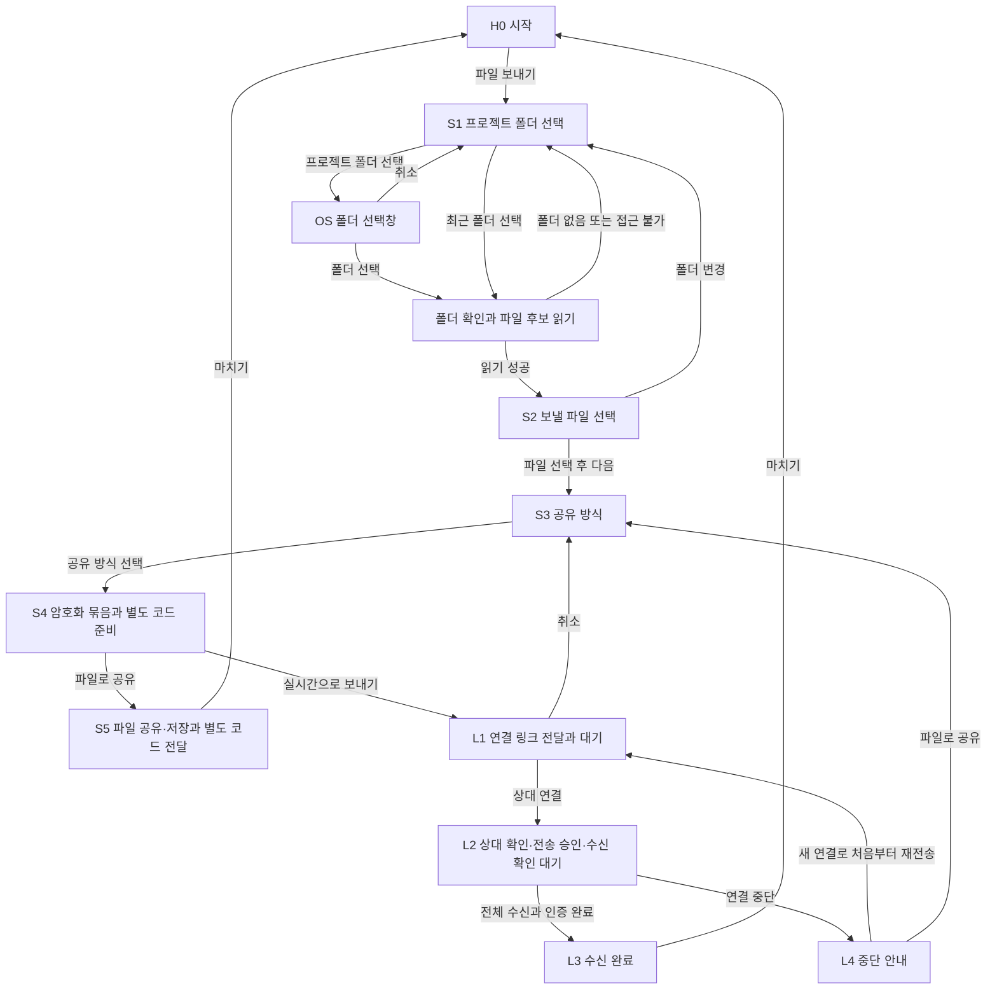
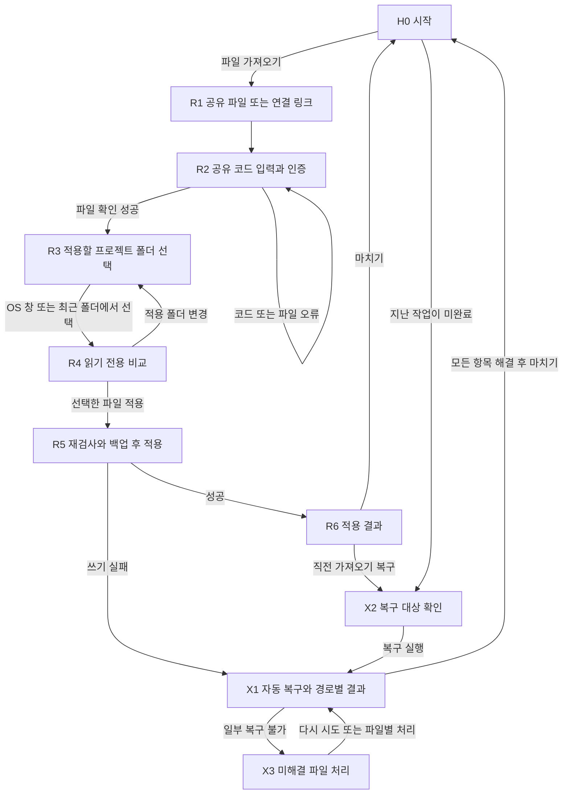
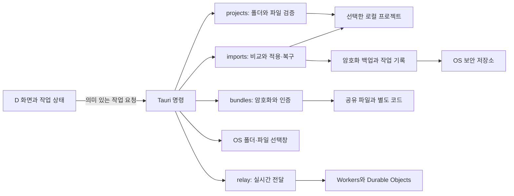
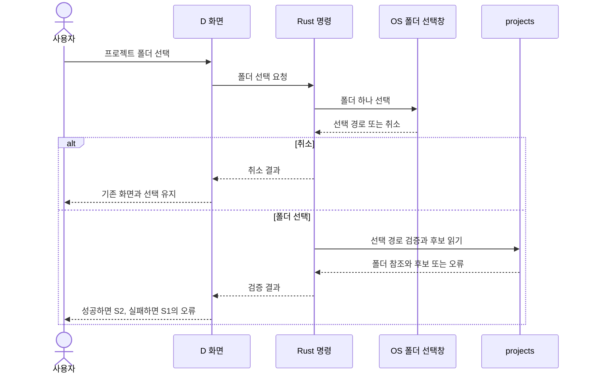

# D 기준 데스크톱 화면 흐름과 구현 설계

작성일: 2026-09-10. 갱신일: 2026-09-11. 상태: 구현 전 검토안.

**확정한 방향:** D를 시각적 기준으로 선택하고 웹을 먼저 구현한다. 웹 1.0 일반 공유와 2.0 실시간 전달을 첫 배포 목표로 둔다. 이 문서는 후속 Tauri 2 데스크톱 앱의 폴더 접근·비교·적용·복구 설계를 보존한다. 현재 착수 범위는 [웹 우선 구현 설계](web-design.md)를 따른다. 데스크톱은 macOS에서 개발하고 Windows에서도 검증한다.

v2.0까지는 서로 아는 사람끼리 일회성으로 전달한다. 파일 공유·AirDrop 등 기존 전달 수단과 링크를 통한 실시간 전송을 함께 제공하고, 계정·이메일 인증·자동 메일 발송은 포함하지 않는다. 서버는 Cloudflare 무료 플랜 범위의 연결·실시간 중계만 맡는다.

**이 문서의 제안:** 아래 화면 구분, 버튼, 상태 전이와 구현 순서. 프로젝트 선택은 기존 제품 계획의 ‘기존 폴더 열기 + 최근 폴더’를 기준으로 구체화했다. 앱에 별도 프로젝트 관리 기능이 필요한지는 이 흐름을 검토하며 조정할 수 있다.

제품 범위와 파일 보호 정책은 [제품 계획](product-plan.md), 용어는 [CONTEXT.md](../CONTEXT.md)를 따른다. 기존 D HTML은 예시 데이터로 동작하는 시각 시안이며, 이 문서에 정의한 모든 상태가 구현되어 있지는 않다.

## 1. D에서 보완해야 할 부분

| 현재 시안 | 실제 앱에서 필요한 동작 |
|---|---|
| `파일 보내기`를 누르면 `orbit-web`이 이미 선택됨 | 처음에는 프로젝트 폴더를 선택하는 화면을 보여준다. 최근 폴더가 없으면 빈 상태부터 시작한다. |
| 프로젝트 이름이 들어 있는 드롭다운 | `프로젝트 폴더 선택`으로 OS 폴더 선택창을 연다. 선택 후에는 폴더명·경로와 `폴더 변경`을 표시한다. |
| `다른 파일 추가`가 예시 파일 하나를 추가함 | 현재 프로젝트 폴더에서 파일 선택창을 열고, 선택한 일반 파일을 검증한 뒤 후보 목록에 추가한다. |
| 받는 쪽도 예시 프로젝트 목록에서 선택 | 수신자가 자기 컴퓨터의 적용 폴더를 직접 고른다. 보낸 사람의 프로젝트 이름으로 자동 연결하지 않는다. |
| 예시 파일은 늘 있고 접근할 수 있음 | 파일 없음, 폴더 이동·삭제, 접근 거부, 읽는 중 변경, Git 상태 확인 실패를 각각 표시한다. |
| 예시 비교 화면에 특정 비밀값이 가려져 있음 | 내용은 기본적으로 표시하지 않는다. 임의 형식의 설정 파일에서 모든 비밀값을 자동으로 찾아 가린다고 약속하지 않는다. |
| 저장·복사 버튼으로 예시 상태만 변경 | OS 창 취소와 실제 쓰기·복사 실패를 성공과 구분한다. 저장·복사가 완료돼도 상대에게 전달됐다고 표시하지 않는다. |

## 2. 전체 화면 흐름

D의 단계별 안내를 유지하되, 프로젝트 선택을 화면과 단계에 포함한다. 보내기는 `프로젝트 → 파일 선택 → 공유 방식 → 전달`, 가져오기는 `공유 파일 → 적용 폴더 → 변경 확인 → 적용 결과`로 안내한다.

### 보내기



### 가져오기와 복구



R1과 R2는 첫 단계인 `공유 파일`, R5와 R6 및 복구 결과는 마지막 단계인 `적용 결과`에 속한다. 처리 중 화면을 별도 작업 이력 메뉴로 만들지는 않는다.

파일 연결이나 연결 링크로 앱을 열면 H0 대신 R1에 해당 입력을 채운다. 확인 없이 대상 프로젝트에 적용하지 않는다. 앱을 닫은 동안 수신한 내용을 자동으로 다시 여는 기능은 첫 구현에 포함하지 않는다.

## 3. 프로젝트 폴더를 고르는 화면

### S1. 처음 보내기

`파일 보내기`를 누르면 다음 화면을 연다. 첫 실행에는 예시 프로젝트나 비어 있는 드롭다운을 보여주지 않는다.

```text
프로젝트  ─  파일 선택  ─  공유 방식  ─  전달

어느 프로젝트에서 보낼까요?
설정 파일이 있는 프로젝트 폴더를 선택해주세요.

[ 프로젝트 폴더 선택 ]

최근에 연 폴더
최근 폴더가 생기면 여기에 표시돼요.

[ 시작 화면으로 ]
```

- `프로젝트 폴더 선택`은 macOS·Windows의 기본 폴더 선택창을 연다. 한 번에 폴더 하나를 고른다.
- 선택은 기존 폴더를 여는 동작이다. 이 앱에서 프로젝트를 생성하거나 Git 저장소를 복제하지 않는다.
- 폴더를 선택하면 경로·접근 가능 여부를 확인하고 파일 후보를 읽는다. 진행 상태는 `폴더 확인 중…`으로 표시한다.
- 성공하면 S2로 이동한다. 취소하면 S1에 그대로 남고 오류를 띄우거나 기록을 추가하지 않는다.
- 확인에 실패하면 선택한 경로와 이유를 S1에 표시하고 `다른 폴더 선택`을 제공한다. 실패한 폴더를 사용 가능한 프로젝트처럼 보이지 않는다.
- Git 저장소가 아닌 일반 프로젝트 폴더도 열 수 있다. Git 판정과 파일 접근 가능 여부는 별개로 처리한다.

최근 폴더가 있으면 폴더명과 경로를 함께 표시한다. 이름이 같은 폴더를 경로로 구분하고, 선택할 때마다 다시 접근 가능 여부를 검사한다. 항목의 `목록에서 제거`는 최근 기록만 지우며 실제 폴더를 삭제하지 않는다. 최근 목록은 최신 사용 순, 최대 5개로 시작하는 제안이다.

### S2. 폴더 선택 후

```text
프로젝트 ✓  ─  파일 선택  ─  공유 방식  ─  전달

어떤 파일을 보낼까요?

보낼 프로젝트                         [ 폴더 변경 ]
orbit-web
~/Projects/orbit-web

공유에 표시할 이름 [ orbit-web   ]
환경 이름          [ development ]

보낼 파일                              [ 모두 선택 ]
[ ] .env                                  1.2 KB
[ ] .env.local                            0.8 KB
[ ] config/firebase.dev.json               2.4 KB

[ 다른 설정 파일 추가 ]
공유에서 제외한 파일 ▸

0개 선택                              [ 공유 방식 선택 ]
```

- 기본 후보는 선택한 폴더 바로 아래의 `.env`, `.env.*` 일반 파일이다. 하위 폴더까지 자동으로 수집하지 않는다. 위 JSON 파일은 사용자가 직접 추가한 상태의 예다.
- 모든 체크는 처음에 비워 둔다. 새 폴더의 표시명은 폴더명, 환경 이름은 `development`를 초깃값으로 제안한다. 최근 폴더에 저장한 표시 설정이 있으면 이를 보여주고 사용자가 확인한다. 값이 비면 다음 단계로 진행하지 않는다.
- 폴더의 실제 이름을 바꾸는 기능과 공유 표시명 편집을 구분한다. 공유 표시명을 수정해도 디스크의 폴더명은 바뀌지 않는다.
- `다른 설정 파일 추가`는 현재 프로젝트 폴더를 시작 위치로 하는 OS 파일 선택창을 연다. 여러 일반 파일을 선택할 수 있으며, 검증을 통과한 파일만 목록에 넣는다. 추가된 파일도 자동 체크하지 않는다.
- 중복 파일은 한 번만 표시한다. 프로젝트 밖 파일, 심볼릭 링크·특수 파일, 크기 제한 초과 항목은 이유와 함께 추가하지 않는다. 외부 파일을 임의로 복사해 넣지 않는다.
- Git 추적 파일은 제외 목록에서 경로와 이유를 보여준다. 상태를 확인하지 못한 파일은 `Git 상태 확인 안 됨`으로 표시하고 사용자가 상태를 확인하도록 한다.
- 후보가 없으면 `이 폴더에서 설정 파일을 찾지 못했어요`와 `다른 설정 파일 추가`, `폴더 변경`을 제공한다. 실제 파일이 없는데 예시 목록으로 채우지 않는다.
- 기본 목록에는 상대 경로·크기·Git 상태를 표시한다. 파일 내용은 펼쳐 보기를 선택한 경우에만 읽기 전용으로 표시한다.

`폴더 변경`은 S1을 열되, 제목을 `프로젝트 폴더 변경`으로 바꾸고 현재 경로와 `파일 선택으로 돌아가기`를 표시한다. 기존 작업은 새 폴더 확인이 성공할 때까지 유지한다. OS 창을 취소하거나 S1에서 돌아오면 이전 폴더·선택·입력값이 그대로 남는다. 다른 폴더를 확정하면 기존 파일 선택과 앱 메모리의 공유 묶음·코드를 폐기하고, 새 폴더 기준으로 표시명·환경 이름을 다시 준비한다. 이미 저장하거나 전달한 파일은 바뀌지 않는다. 같은 폴더를 다시 선택하면 목록을 재검사하고 없어진 파일의 선택을 해제한다. 파일 내용이 바뀌었으면 생성한 묶음도 무효화한다.

### R3. 적용할 폴더 선택

```text
공유 파일 ✓  ─  적용 폴더  ─  변경 확인  ─  적용 결과

어디에 적용할까요?
받은 설정을 넣을 내 컴퓨터의 프로젝트 폴더를 선택해주세요.

받은 설정: orbit-web · development
파일 3개

[ 적용할 폴더 선택 ]

최근에 연 폴더
orbit-web       ~/work/orbit-web
sample-client   ~/work/sample-client

[ 공유 파일로 돌아가기 ]
```

폴더 선택 자체는 읽기 전용 비교를 준비하는 동작이다. 선택과 접근 검사가 성공하면 R4로 이동하고, 그곳에서 실제 적용 위치를 다시 보여준다. 폴더 이름이 송신자 표시명과 같아도 자동 선택하지 않는다.

R4에는 `적용할 폴더 · 전체 경로 · 폴더 변경`을 표시한다. 다른 폴더로 바꾸면 비교를 다시 실행하고 기존 파일 교체 선택을 초기화한다. OS 창 취소는 기존 비교와 선택을 보존한다. 폴더 안에 파일이 없으면 유효한 받은 파일을 새 파일로 비교할 수 있다.

## 4. 화면별 계약

| 화면 | 사용자에게 보여줄 것 | 주요 행동과 다음 화면 | 취소·실패 시 |
|---|---|---|---|
| H0 시작 | `파일 보내기`, `파일 가져오기`, 미완료 복구 알림 | 보내기→S1, 가져오기→R1 | 미완료 작업이 있는 프로젝트의 새 적용은 제한 |
| S1 프로젝트 선택 | 폴더 선택 버튼, 최근 폴더, 접근 오류 | 선택·검사 성공→S2 | 기존 화면과 작업을 유지 |
| S2 파일 선택 | 선택한 폴더·경로, 표시명·환경, 파일 후보 | 유효한 파일 1개 이상 선택→S3 | 빈 목록·읽기 실패를 구분 |
| S3 공유 방식 | 공유할 경로·개수·크기, 두 방식의 설명 | `파일로 공유` 또는 `실시간으로 보내기` 선택→S4 | 뒤로 가면 S2 입력 유지 |
| S4 묶음 준비 | 암호화 묶음·코드 생성 상태, 실패 이유 | 완료 후 선택한 방식에 따라 S5 또는 L1 | 실패하면 재시도·S2 수정. 성공한 것처럼 코드나 파일을 제공하지 않음 |
| S5 파일 전달 | OS 공유·파일 저장, 별도 공유 코드, 각 작업 상태 | 공유 또는 저장 후 코드 별도 전달, `마치기`→H0 | 공유·저장 취소와 실패를 구분. 복사 실패는 수동 선택·복사 제공 |
| L1 연결 대기 | 링크 복사, 별도 코드, 상대 대기 상태 | 개인 대화로 링크 전달, 상대 연결→L2 | 만료·취소·무료 한도·중계 장애 시 세션을 정리하고 S3에서 다시 선택 |
| L2 상대 확인·전송 | 연결된 기기, 파일 요약, 상대 확인 안내, 전송 버튼·진행률·수신 확인 대기 | 대화로 상대 확인 후 `전송 시작`, 수신 앱의 전체 암호문 인증과 완료 응답→L3 | 승인 전에는 전송하지 않음. 중단·확인 대기 시간 초과→L4 |
| L3/L4 전송 결과 | 수신 완료 또는 중단, 적용은 수신자 결정임을 안내 | 완료→H0, 재전송→새 L1, 파일로 공유→S3 | 수신 완료 응답이 없으면 성공으로 표시하지 않음 |
| R1 공유 파일 열기 | 파일 선택 또는 연결 링크 입력 | 파일 읽기·실시간 수신→R2 | 선택 취소, 링크 오류, 연결 실패를 구분 |
| R2 코드 입력 | 공유 코드 입력, 열기 버튼 | 인증·형식·내용 제한 통과→R3 | 입력 보존, 잘못된 코드/손상 파일 오류, 대상 파일 쓰기 없음 |
| R3 적용 폴더 | 받은 설정 요약, 로컬 폴더 선택, 최근 폴더 | 폴더 검사와 비교→R4 | 취소·접근 오류 시 대상 미변경 |
| R4 변경 확인 | 대상 경로, 새 파일/동일/변경/적용 불가, 선택 결과 | `N개 파일 적용`→R5 | 바뀐 로컬 상태는 다시 비교, 적용 불가 이유 표시 |
| R5 적용 | 사전 검사·백업·쓰기 진행 상태 | 완료→R6, 쓰기 실패→X1 | 백업 이전 실패는 미적용. 일부 변경 후 실패는 자동 복구 |
| R6 적용 결과 | 파일별 추가·교체·건너뜀, 복구 진입 | `마치기`→H0, 복구→X2 | 전달자에게 수신자의 로컬 경로·내용을 보내지 않음 |
| X2 복구 확인 | 복구할 기존 파일, 삭제할 새 파일, 사용자 수정 상태 | 확인 후 복구→X1 | 취소하면 파일·백업 유지 |
| X1/X3 복구 결과 | 복구됨·현재 파일 유지·미해결 경로와 이유 | 재시도 또는 파일별 처리 | 미해결 항목과 백업·작업 기록을 보존 |

S3의 `파일로 공유`는 생성한 `.envhandoff` 파일을 OS 공유·AirDrop·파일 첨부 등으로 전달하는 경로다. relay 연결이나 양쪽 앱의 동시 접속이 필요하지 않으며, 수신자는 나중에 열어도 된다. S5에서는 파일 저장·OS 공유 결과만 표시하고 상대의 수신·열기 완료로 바꾸지 않는다. OS 공유 수단은 플랫폼별로 검증하며, 파일 저장은 별도로 제공한다.

`실시간으로 보내기`는 연결 링크를 만들어 개인 대화로 전달하고 양쪽 앱이 접속한 동안 전송하는 경로다. L2에는 `대화 중인 상대인지 확인한 뒤 보내세요`를 안내한다. 기기 이름을 검증된 사람의 이름처럼 표시하지 않으며 이메일 입력·인증 화면을 추가하지 않는다. 두 방식 모두 공유 코드를 파일이나 연결 링크와 한 번에 복사·공유하지 않고 별도 경로로 전달하도록 안내한다.

R1의 실시간 수신은 코드가 입력되기 전에는 ‘암호화 파일 수신, 확인 대기’다. 송신자의 L2도 전송률 100% 이후에는 `수신 확인 대기`를 표시한다. R2에서 전체 암호문 인증까지 성공해야 송신자에게 수신 완료를 알린다. 잘못된 코드 입력은 완료 응답을 보내지 않으며, 취소·연결 종료·확인 대기 시간 초과는 중단으로 처리한다. 시간 제한값은 relay 구현 전에 정한다. 수신 완료, 이메일·신원 인증, 프로젝트 적용 완료는 서로 다른 의미다.

## 5. 선택·뒤로 가기·중단 규칙

1. **새 작업:** 처음 선택하는 파일의 체크는 비어 있다. 보내기 작업을 마치고 새로 시작할 때도 마지막 체크를 자동 적용하지 않는다.
2. **뒤로 가기:** 같은 작업에서는 폴더·환경·파일 선택을 유지한다. 생성된 묶음은 파일 선택이나 메타데이터가 바뀌거나, 원본 파일 변경을 재검사에서 발견하면 무효화한다. 파일을 실시간 감시하지 않으며 생성 결과는 생성 시점의 스냅샷임을 표시한다. 다시 생성하면 새 공유 코드를 만든다.
3. **비교 선택:** 새 파일은 기본 선택, 동일한 파일은 건너뜀, 내용이 다른 기존 파일은 기본 미선택이다. 적용 불가·Git 추적 항목에는 이유를 표시하고 선택을 막는다.
4. **Git 제외 확인:** 추적되지 않았지만 ignore되지 않은 대상은 `로컬 Git 제외에 추가` 또는 위험을 이해한 명시적 확인이 필요하다. 공유된 `.gitignore`는 자동 수정하지 않는다. 임시 파일의 Git 제외 확보는 별도로 검사하며, 이 검사 실패는 사용자 확인으로 우회하지 않는다.
5. **다른 폴더:** 실제로 변경을 확정한 경우에만 현재 선택을 초기화한다. 취소는 상태 변경이 아니다. 받는 쪽의 다른 폴더 선택은 비교 결과와 교체 동의를 다시 만든다.
6. **로컬 변경:** 비교 이후 파일이 바뀌거나 없어지면 적용하지 않고 변경 사실과 재비교 버튼을 보여준다. 이전 비교 결과에 대한 동의를 새 상태에 재사용하지 않는다.
7. **진행 중 이동:** 파일 생성·전송·적용 중에는 중복 실행을 막는다. 중단 가능한 작업은 `취소`를 제공하고, 파일 적용·복구 중에는 완료 또는 복구 결과를 기다린다. 창을 닫는 경우도 같은 규칙을 적용한다.
8. **앱 재실행:** 코드와 평문·선택 체크는 자동 복원하지 않는다. 최근 폴더와 표시 설정, 복구 기록만 읽는다. 미완료 작업은 사용자에게 안내한 뒤 복구하며 해당 프로젝트의 새 적용을 막는다.
9. **사용자 수정과 복구:** 앱의 적용 이후 수정된 파일은 자동으로 덮어쓰거나 삭제하지 않는다. 파일별 현재 상태 유지 또는 백업 복구를 확인받는다. 현재 상태를 유지한 경우에는 그 사실을 결과에 남기며 ‘모든 파일이 원래대로 복구됨’으로 표시하지 않는다.
10. **키보드와 읽기 순서:** 화면 전환 시 제목, 입력 오류 시 해당 입력으로 포커스를 옮긴다. OS 창을 취소하면 이를 열었던 버튼으로 돌아온다. 활성 단계와 파일 상태는 색 외에 이름·아이콘으로도 표시한다. 하단 고정 버튼이 포커스를 가리지 않게 한다.

정확한 파일 제한, 경로 검증, 암호화 백업과 복구 정책은 제품 계획 4·5절을 따른다. 화면을 간결하게 만들기 위해 적용 전 검사를 생략하지 않는다.

## 6. 구현 구조

화면은 사용자의 선택과 진행 상태를 관리한다. 실제 파일 접근·묶음 생성·인증·적용·복구는 Rust에서 수행한다. 일반 공유와 실시간 공유는 같은 묶음 형식과 가져오기 동작을 사용한다.



| 담당 | 감추어야 할 복잡성 | 화면이 받는 결과 |
|---|---|---|
| `projects` | OS에서 선택한 폴더의 식별, 접근 검사, 후보 탐색, 상대 경로·Git 상태 검사, 최근 폴더 기록 | 폴더 참조, 표시용 경로, 후보와 제외 이유 |
| `bundles` | 크기 제한, 원본 바이트 읽기, 읽는 중 변경 감지, 암호화·인증, 형식 검증 | 생성/열기 결과와 묶음 참조. 코드 표시·복사는 명시적 사용자 행동에 연결 |
| `imports` | 비교 상태 보관, 적용 직전 재검사, 백업 키 확보, 파일별 쓰기, 작업 기록, 실패·재실행 복구 | 파일별 차이, 선택 가능한 항목, 적용·복구 진행과 결과 |
| `relay` | 일회성 연결, 승인된 수신자 한 명, 승인 전 미전송, 전송 제한, 중단 처리, 전체 수신·암호문 인증 응답 | 대기·연결·전송·수신 확인 대기·수신 완료·중단. 신원 인증·프로젝트 적용 결과와 구분 |

처음부터 여러 저장소 구현, 범용 파일 관리자, 플러그인 계층을 만들지 않는다. 한 앱에서 동시에 하나의 변경 작업만 진행하는 것으로 시작한다. 여러 프로젝트를 병렬로 처리해야 할 실제 요구가 생기면 프로젝트별 작업 제어로 확장한다.

예상 배치는 다음과 같다. 아직 생성된 앱 폴더나 확정된 코드 인터페이스를 뜻하지 않는다.

```text
apps/
  desktop/
    src/                     D 화면, 작업 상태, Tauri 호출
    src-tauri/src/
      lib.rs                 앱 구성과 명령 진입점
      projects.rs            폴더·후보·최근 기록
      bundles.rs             공유 묶음 생성·열기
      imports.rs             비교·적용·백업·복구
      relay.rs               2.0 전송을 구현할 때 추가
  server/                    2.0에서 추가: 중계 세션
```

### 폴더 선택부터 파일 목록까지



Tauri의 공식 Dialog 플러그인은 데스크톱의 기본 파일·폴더 선택창을 지원하고 Rust에서도 사용할 수 있다. 폴더 선택 취소를 정상 결과로 처리한다. 구체적인 호출과 OS별 접근 유지 방식은 데스크톱 첫 구현 D0에서 검증한다. [Tauri Dialog 문서](https://v2.tauri.app/plugin/dialog/)

### 화면과 코어가 주고받는 정보

아래 이름은 동작을 구분하기 위한 설계 이름이며, 확정된 함수 시그니처가 아니다.

| 동작 | 입력의 의미 | 반환의 의미 |
|---|---|---|
| `chooseProjectFolder` / `openRecentProject` | OS 선택 또는 최근 폴더 항목, 보내기/적용 용도 | 검증된 폴더 참조, 표시 경로, 취소 또는 오류 |
| `listShareCandidates` / `addShareFiles` | 폴더 참조, OS에서 고른 파일 | 상대 경로·크기·Git 상태·공유 가능 여부 |
| `exportBundle` | 폴더 참조, 선택한 상대 경로, 표시명·환경 이름 | 메모리의 암호화 묶음 참조, 별도로 취급하는 공유 코드 |
| `saveBundle` | 생성한 묶음 참조, OS 저장창의 선택 결과 | 실제 저장 완료, 취소 또는 쓰기 실패 |
| `inspectBundle` | 공유 파일/수신 묶음, 입력한 코드 | 인증을 통과한 묶음 참조와 표시용 메타데이터 |
| `compareImport` | 열린 묶음 참조, 수신자가 고른 폴더 참조 | 비교 참조, 경로별 상태와 적용 가능 여부 |
| `applyImport` | 비교 참조, 사용자가 선택한 경로 | 재검사·백업·적용·복구 상태와 최종 결과 |
| `restoreImport` | 로컬 작업 참조, 파일별 명시적 선택 | 복구·유지·미해결 결과 |

Rust는 폴더 참조를 검증한 로컬 경로에 연결한다. 화면이 전달한 임의의 절대 경로를 쓰기 권한으로 인정하지 않는다. 참조를 사용해도 파일 상태와 경로 안전성은 매번 재검사한다. 복호화된 전체 묶음은 Rust 메모리에 두고, 화면에는 표시와 사용자가 요청한 미리보기에 필요한 정보만 전달한다.

WebView에 허용할 명령은 필요한 동작으로 제한한다. 플러그인 권한과 사용자 정의 Rust 명령의 파일 검증은 별개로 설계하며, 권한 설정만으로 파일 경로 안전성이 보장된다고 가정하지 않는다. [Tauri 명령 구조](https://v2.tauri.app/develop/calling-rust/), [권한 설정](https://v2.tauri.app/security/capabilities/)

### 상태와 저장 범위

| 위치 | 둘 것 | 수명 |
|---|---|---|
| 화면 메모리 | 현재 단계, 입력값, 파일 선택, 펼침 상태, 진행률 | 현재 작업. 뒤로 가기는 보존, 새 작업은 초기화 |
| Rust 메모리 | 검증한 폴더·묶음·비교 참조, 작업 중 필요한 파일 바이트와 키 | 현재 작업. 명시적 종료 시 참조 폐기 |
| 로컬 설정 | 최근 폴더 경로, 표시명·환경 이름 같은 비밀이 아닌 설정 | 앱 재실행 후 유지. 사용자 제거 지원 |
| 앱 전용 로컬 보관 | 암호화한 직전 가져오기 백업, 미완료 작업 기록 | 제품 계획의 복구 보관 정책을 따름 |
| OS 보안 저장소 | 로컬 백업을 여는 키 | 백업의 수명과 함께 관리 |
| 2.0 중계 서버 | 연결·세션 상태, 전송 중 암호문 버퍼 | 일회성 연결 동안. 파일 저장·코드 기록 없음 |

공유 코드, 설정 파일 내용과 암호문을 분석 이벤트나 로그에 넣지 않는다. 링크의 세션 접근 정보도 로그에서 제외한다. UI의 단계는 작업의 성공 증거가 아니며 Rust의 결과와 수신자의 인증 응답으로 상태를 확정한다.

## 7. 구현 순서와 확인할 결과

| 순서 | 만들 것 | 완료를 확인하는 사용자 행동 |
|---|---|---|
| 0 | 화면 흐름·상태 검토, D에 빠진 빈 상태와 폴더 변경 반영 | 첫 실행 사용자가 폴더를 고르고 다른 폴더로 바꾸는 위치를 설명 없이 찾음 |
| 1 | Tauri 최소 앱 + H0/S1/S2 + 기본 폴더·파일 선택 | 실제 빈 최근 목록→폴더 선택→후보 표시. 취소·접근 실패·파일 없음·다른 파일 추가 검증 |
| 2 | 묶음 형식·암호·키 보관 검증 후 S3/S4/S5 | 가짜 설정 파일을 생성·저장하고 잘못된 코드·손상 파일을 거부함 |
| 3 | R1~R6 + 백업·자동 복구·재실행 복구 | 수신자가 다른 로컬 경로를 선택해 비교·적용하고, 실패·사용자 수정에도 파일을 보존함 |
| 4 | 파일 열기 연결·OS 공유와 화면 전체 연결 | 두 기기로 파일 공유→별도 코드 전달→폴더 선택→적용·복구 |
| 5 | L1~L4 + 실시간 수신 + 중계 서버 | 계정·이메일 인증 없이 상대 확인 후 승인·전송, 만료·중단·새 연결 재전송, 무료 한도·중계 장애 시 파일 공유, 수신 완료와 적용 완료 구분 |
| 6 | macOS·Windows 검증과 첫 배포 준비 | 1.0과 2.0의 전체 흐름, 파일 권한·배포 경로·복구·서버 보관 금지 조건 통과 |

데스크톱 착수 시 처음 구현할 범위는 **H0 → S1 → OS 폴더 선택창 → S2**다. 실제 폴더 선택의 성공·취소·오류가 화면 상태에 연결되는지부터 확인한다.

지원 OS 최소 버전, Rust 암호 라이브러리, OS 보안 저장소·공유 연동의 상세는 제품 계획의 D0에서 확정한다. 공유 파일의 바이트 규격은 웹 M0에서 확정한 규격을 함께 사용하고 테스트 벡터로 호환성을 검증한다. 이 문서는 이를 이미 구현·검증한 것으로 취급하지 않는다.

## 8. 흐름 검토 시나리오

- 처음 쓰는 사람이 H0에서 보내기를 눌러 빈 최근 목록을 본다. 폴더 선택을 취소한 뒤 다시 열어 프로젝트를 선택한다.
- 같은 이름의 폴더 두 개를 최근 목록에서 경로로 구분한다. 이동·삭제된 폴더를 눌렀을 때 다른 폴더를 선택할 수 있다.
- `.env`가 없는 프로젝트에서 JSON 파일을 직접 추가한다. 프로젝트 밖 파일은 목록에 들어가지 않는다.
- 파일을 선택한 뒤 폴더 변경을 취소하면 선택이 남는다. 다른 폴더를 확정하면 기존 선택과 공유 코드는 재사용되지 않는다.
- 파일 저장을 취소하거나 클립보드 복사가 실패해도 저장·전달 완료로 표시하지 않는다.
- 파일로 공유를 선택해 OS 공유·AirDrop 또는 파일 저장으로 전달한다. relay와 이메일 인증 없이 수신자가 나중에 파일·코드로 열 수 있으며, 송신 앱은 상대의 수신 완료를 추측하지 않는다.
- 실시간 전송은 묶음 준비에 성공한 뒤 연결 링크를 제공한다. 상대가 접속해도 송신자가 승인하기 전에는 파일을 전송하지 않는다. 무료 한도·중계 장애가 발생하면 파일 공유로 돌아갈 수 있다.
- 수신자의 프로젝트명이 보낸 사람과 같아도 적용 폴더를 직접 고른다. 다른 적용 폴더로 바꾸면 기존 파일 교체 선택이 해제된다.
- 비교 이후 파일을 수정하면 재비교를 요구한다. 적용 중 실패하거나 앱을 강제 종료해도 복구 경로가 있다.
- 적용 이후 사용자가 파일을 수정한 다음 복구한다. 해당 수정이 자동으로 덮어써지지 않는다.
- 실시간 암호문 수신 후 잘못된 코드를 입력하면 송신자에게 인증 완료로 응답하지 않는다. 중단된 전송은 새 연결에서 처음부터 다시 받는다.

첫 구현의 테스트는 가짜 파일과 임시 프로젝트로 이 경로들을 검증한다. 문서와 시안 검토만으로 실제 파일 보호나 OS 연동 검증을 대신하지 않는다.
