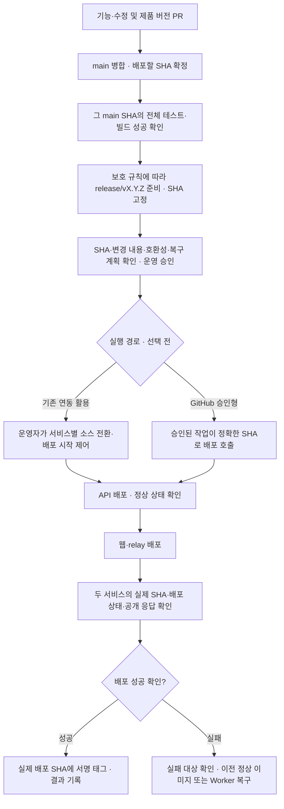

# 버전별 배포 브랜치와 운영 배포 흐름

전환 목표는 고정 `release` 대신 `release/v0.0.5`, `release/v0.0.6`처럼 **배포마다 새 버전 브랜치를 사용하는 것**이다. 검증한 `main` 커밋을 버전별로 보존한다. 운영 배포를 기존 서비스의 소스 전환으로 시작할지, GitHub 승인 작업으로 시작할지는 검토 중이다. 이전 운영 브랜치에 다음 개발 코드를 병합하지 않으므로 `release → main` 이력 동기화 PR을 반복할 필요가 없다.

**현재 운영은 아직 고정 `release` 방식이다.** 2026-10-01 확인 기준 제품 버전은 `0.0.4`이며, Openship의 API 자동 배포와 Cloudflare의 웹·relay 배포가 `release`에 연결되어 있다. 아래는 전환 준비 절차다. 문서나 CI 변경만으로 기존 브랜치·보호 규칙·운영 연결을 변경하지 않는다. PR 생성·운영 승인·소스 전환·서명 태그 생성을 자동화하는 작업은 아직 없다.

## 단계별 전환

| 단계 | 준비할 내용 | 완료 확인 |
| --- | --- | --- |
| 1. 문서 | 브랜치 역할·검증·승인·복구·공개 범위 확정 | 이 문서와 배포 가이드 검토 |
| 2. CI | PR 검사에 전체 테스트·빌드를 추가하고 main·버전 브랜치의 push도 검사 | 실제 main 병합 커밋의 전체 검증 성공 |
| 3. 보호 | `release/*` 최초 생성 시 검사 성공 조건과 이후 변경·삭제·강제 push 제한 준비 | 새 브랜치에 적용될 규칙과 권한 확인 |
| 4. 연동 준비 | 실행 경로 선택·배포 시작 방법·인증·이전 배포 복구 방법 확인 | 현재 운영을 유지한 채 전환·복구 계획 검토 |
| 5. 최종 전환 | 준비한 변경을 확인한 뒤 기존 release 정리·버전 브랜치 생성·선택한 실행 경로 적용 | 실제 배포 SHA·운영 응답·성공 후 태그 확인 |

현재 저장소 변경은 문서·CI·보호 규칙 초안 준비다. 원격 보호와 배포 연결은 아직 변경하지 않았다. 3·4단계 검토가 끝나면 삭제할 ref, 보존한 정상 배포, 배포할 SHA, 두 서비스에 적용할 설정을 구체적으로 확인하고 최종 전환한다.

## 브랜치와 태그의 역할

| 브랜치 / 태그 | 역할 | 운영 배포를 시작하나? |
| --- | --- | --- |
| `feature/*`, `fix/*` | 기능·수정 작업 후 main에 PR | 아니요 |
| `main` | 검토한 코드와 제품 버전 변경을 모음 | 아니요 |
| `release/vX.Y.Z` | 전체 검증을 통과한 main SHA를 가리키는 버전별 배포 스냅샷 | 생성 자체는 운영 승인·배포를 대신하지 않음 |
| 서명 태그 `vX.Y.Z` | 성공을 확인한 실제 배포 SHA의 기록 | 태그 자체로 배포하지 않음 |

버전 브랜치는 승인한 SHA를 유지한다. 생성 이후 추가 커밋·병합·강제 push를 하지 않는다. 수정은 `main` 대상 PR로 반영하고 다음 버전 브랜치에서 배포한다. [보호 규칙 초안](../.github/rulesets/versioned-releases.json)은 최초 생성에도 GitHub Actions의 필수 검사 성공을 요구하고 후속 업데이트·삭제·강제 push를 막는다. 원격에는 아직 적용하지 않았다. [GitHub 규칙](https://docs.github.com/en/repositories/configuring-branches-and-merges-in-your-repository/managing-rulesets/available-rules-for-rulesets)

## 실행 경로 비교

버전별 스냅샷을 쓰는 목표는 동일하다. 아래 두 실행 경로 중 어느 쪽을 적용할지는 아직 결정하지 않았다.

| 구분 | 기존 자동 배포 활용 | GitHub 승인형 배포 |
| --- | --- | --- |
| 최초 준비 | 기존 연동을 활용하므로 초기 작업이 적음 | 전용 배포 키·토큰과 실행기 접속 경로를 먼저 설정 |
| 매회 배포 | 두 서비스의 운영 소스를 해당 버전 브랜치로 전환 | 정확한 SHA를 지정한 작업을 승인하고 실행 |
| 순서와 확인 | API 성공 후 웹을 시작하도록 운영자가 순서·실제 SHA 확인 | 작업이 같은 SHA로 API 후 웹을 배포하고 상태 확인 |
| 중복·승인 보호 | 소스 전환 자체의 자동 실행 여부 확인 필요 | 기존 독립 자동 배포가 승인 전에 실행하거나 중복 배포하지 않도록 차단 필요 |

GitHub 승인형은 반복 작업을 줄일 수 있지만 배포 워크플로·자격 증명·관리 API 접속과 기존 자동 배포 경로를 함께 준비해야 한다. 현재는 배포 자동화와 GitHub 운영 승인 환경 모두 구현·적용하지 않았다.

## 전환 후 배포 흐름 설계

아래 Mermaid는 미적용 설계이며, 실행 경로 선택 후 구체적인 설정과 명령을 확정한다.

이 설계는 API 성공을 확인한 뒤 웹을 시작하는 순서를 요구한다. 기존 독립 자동 배포가 서로 기다린다는 뜻은 아니다. 기존 연동 방식은 운영자가 시작 시점을 제어하고, GitHub 승인형은 작업 안에서 순서를 제어해야 한다. API가 바뀌지 않는 배포는 실행 코드가 같은지와 현재 정상 상태를 확인하고 건너뛴 사유를 기록한다.

## CI와 승인을 통과시키는 방법

1. 제품 버전은 `main` 대상 PR에서 루트·웹·API·relay·protocol의 `package.json` 다섯 곳에 같은 값으로 올린다. 버전 준비 PR에 변경 요약·포함 PR·호환성·DB 및 환경변수 변경·복구 계획을 기록한다.
2. PR 검사뿐 아니라 **병합된 main SHA 자체의 전체 `pnpm check` 성공**을 확인한다. PR의 임시 병합 커밋에 대한 성공만으로 다른 SHA를 배포하지 않는다. 테스트는 전용 임시 PostgreSQL DB를 사용하며 운영 DB·배포 자격 증명에 접근하지 않는다.
3. 최초 생성에도 검사 성공을 요구하는 보호 규칙을 먼저 적용한다. **main SHA의 CI 성공 → 그 SHA로 버전 브랜치 생성 → 동일 SHA의 브랜치 CI·보호 설정 확인** 순서로 준비한다. 최초 생성은 PR 병합이 아니므로 PR 대상에 `release/**`를 추가하는 것만으로 검증이 강제되지는 않는다.
4. 운영자는 정확한 버전·SHA·검증 결과·변경 요약·순서·이전 정상 배포를 확인하고 승인한다. 승인과 배포 결과는 버전 준비 PR에 기록한다. 준비하는 동안 main이 앞서가더라도 승인한 SHA는 바꾸지 않는다.
5. 선택한 실행 경로에서 승인 뒤에만 배포를 시작한다. 기존 연동을 사용할 때는 소스 설정 변경 자체가 배포를 시작할 수 있다. GitHub 승인형이라면 기존 독립 자동 배포가 승인 경로를 우회하지 않도록 전환해야 한다.

현재 [배포 PR 템플릿](../.github/PULL_REQUEST_TEMPLATE/release.md)은 `main → release` 방식용이다. 고정 release를 사용하는 전환 준비 기간에는 그대로 사용한다. 버전별 방식의 최종 적용 때에는 main의 버전 준비 PR과 배포 후 기록에 맞춰 대상·소스 검증, 병합 지시, 실제 배포 SHA 항목을 바꾼다.

## Openship·Cloudflare의 연결

- **Openship:** 현재 API 소스는 `release`, Auto Deploy는 활성화되어 있다. 설치된 버전의 브랜치 변경은 소스 브랜치 값만 바꾸며 브랜치 존재 확인·즉시 배포·webhook 교체·실행 중 컨테이너 변경을 하지 않는다. 기존 연동 방식에서는 저장소 연결을 다시 만들지 않고 브랜치 값만 전환한 뒤 최초 배포를 명시적으로 시작한다. GitHub 승인형에서는 실행기가 정확한 SHA를 지정하는 배포 호출과 인증·접속 경로를 검증해야 한다. [자동 배포 문서](https://openship.io/docs/guides/auto-deploy)
- **Cloudflare:** 실제 빌드 설정 화면에서 production branch는 현재 `release` 하나이며, 원격에 존재하는 브랜치를 선택한 뒤 별도로 저장한다. 해당 브랜치의 push가 자동 빌드를 시작한다고 안내한다. 기존 연동 방식이면 버전마다 이 소스를 전환한다. 설정 저장이 즉시 빌드를 시작하는지는 검증하지 않았으므로 준비 단계에서 확인해야 한다. GitHub 승인형이면 승인된 SHA의 빌드를 Wrangler로 배포하고 기존 브랜치 자동 배포의 중복 실행을 막아야 한다. preview branch 패턴은 운영 브랜치 선택을 대신하지 않는다. [빌드 브랜치 문서](https://developers.cloudflare.com/workers/ci-cd/builds/build-branches/)
- **보호와 시작 경로:** 기존 이름 `release`의 보호는 `release/vX.Y.Z`에 자동 이전되지 않는다. 새 규칙을 먼저 준비한다. GitHub Actions로 운영 승인을 적용한다면, 독립 자동 배포가 그 승인을 우회하지 않도록 배포 시작 경로까지 함께 바꿔야 한다.

기존 연동을 활용하면 **매번 두 서비스의 운영 소스를 선택·전환하는 비용**이 있다. GitHub 승인형은 이 반복 작업을 줄이는 대신 첫 인증·워크플로 설정이 필요하다. 브랜치를 `release/v0.0.5`로 이름 짓는 것만으로 배포 작업이 자동화되지는 않는다.

## 기존 release를 정리하기 전

Git에서는 `release`와 `release/v0.0.5`가 공존할 수 없다. 원격 `release`를 삭제하면 버전별 원격 브랜치를 만들 수 있지만, 삭제 전에 다음을 확인한다.

1. 현재 정상 배포의 커밋·서명 태그·API 이미지·Worker 버전과 복구 방법을 보존한다. 기존 release SHA를 `release-legacy/v0.0.4`처럼 충돌하지 않는 보존 ref에 남기고 SHA 일치를 확인한다. 기존 태그는 옮기지 않는다.
2. 기존 release에 진행 중인 PR·배포·webhook 이벤트가 없는지 확인하고 선택한 실행 경로의 전환 계획을 준비한다. 브랜치 삭제를 서비스 중지나 배포 성공으로 간주하지 않는다.
3. 로컬 `release` 브랜치와 이를 사용하는 worktree를 확인한다. 필요한 이력과 작업은 `release-legacy/v0.0.4`처럼 `release/`와 충돌하지 않는 이름으로 보존한다. 사용 중인 worktree나 변경을 무조건 삭제하지 않는다.
4. 원격 삭제 후 각 체크아웃에서 `git fetch --prune origin`으로 오래된 `origin/release` 추적 ref를 정리한다. 로컬 `release`와 원격 추적 ref가 남아 있으면 버전별 브랜치 생성·fetch에도 접두사 충돌이 생길 수 있다.
5. 승인한 SHA로 새 버전 브랜치를 준비하고 검증 결과를 확인한다. 이후 앞의 운영 승인·배포 순서대로 진행한다. `release/v0.0.5`와 `release/v0.0.6`는 함께 보존할 수 있다.

최초 전환 순서는 **main SHA 전체 검증·연동 준비 → 보존 ref 확인 → 고정 release 삭제 → 검증한 SHA로 버전 브랜치 생성 → 같은 SHA의 CI·보호 확인 → 선택한 실행 경로 적용 → 최초 배포·검증**이다. 버전 브랜치가 남아 있으면 고정 `release`를 다시 만드는 것도 접두사 충돌로 막힌다. 복구를 위해 버전 브랜치를 일괄 삭제하지 않는다.

## 배포 확인과 실패 복구

배포 요청 접수나 소스 저장만으로 성공 처리하지 않는다. 두 서비스에서 승인한 SHA와 실제 배포 SHA, 배포 ID, 최종 상태를 각각 확인한다. 공개 웹의 제품 버전·변경 화면·relay `/api/health`, API·DB 상태 및 무쿠키 `/auth/session`의 `401` 응답을 점검한다. 필요한 기능·로그인 검사는 변경 범위에 맞춰 수행한다.

한쪽 배포가 실패하면 다음 대상의 배포를 멈추고 실제 상태부터 확인한다. 복구는 다음과 같이 대상별로 한다.

- **API:** 이전에 정상 동작한 실제 이미지와 서비스 설정으로 되돌린다. 실패한 버전 브랜치를 덮어쓰거나 DB·영속 볼륨·삭제대장을 초기화하지 않는다.
- **웹·relay:** 이전 정상 Worker 버전으로 복구하고 공개 화면과 `/api/health`를 다시 확인한다.
- **DB 변경이 있는 경우:** 배포 전에 이전 API 이미지가 변경된 스키마에서 실행 가능한지 검토한다. 불가능하면 자동으로 구버전 API를 실행하지 말고 준비한 수정 배포 또는 [데이터 복원 절차](operations.md#과거-백업에서-복원할-때)를 따른다. 코드 복구와 과거 DB 복원은 별개다.

기존 연동 방식은 실패한 브랜치를 자동으로 재배포하지 않도록 확인하고 필요하면 이전 정상 버전 브랜치 또는 보존 ref로 브랜치 값만 되돌린다. GitHub 승인형은 실패한 작업의 이후 배포를 중단하고 이전 정상 버전 복구를 별도로 실행한다. 전환 첫 배포에서는 기존 release를 재생성하기보다 보존한 Openship 배포 ID·실제 이미지와 Worker 버전으로 복구한다. 이 경로는 기존 release 삭제 전에 확인해 둔다. API·웹이 서로 다른 정상 SHA를 사용하는 경우에는 실제 상태와 호환성을 기록한다.

성공한 실제 배포 SHA에만 서명 태그 `vX.Y.Z`를 만들고 push한다. 실패한 배포에 성공 태그를 붙이거나 기존 태그를 옮기지 않는다. 배포 결과·승인 및 실제 SHA·각 배포 ID·확인 시각·태그·건너뛴 대상의 사유를 버전 준비 PR에 남긴다.

## 대안: 고정 release 유지

고정 release를 계속 쓴다면 최신 `release`에서 임시 `deploy/vX.Y.Z` 브랜치를 만들고 선택한 main 커밋을 병합해 `deploy/vX.Y.Z → release` PR을 열 수 있다. PR 소스가 최신 release 이력을 포함하므로 별도 `release → main` 동기화 PR을 없앨 수 있다. 배포 후보의 파일 내용이 선택한 main과 같은지, 전체 검증·필수 CI·리뷰 결과가 정상인지 확인한 뒤 merge commit으로 병합한다. 이 경우 기존 두 서비스의 소스 연결은 유지한다.

현재 선택한 전환 목표는 버전별 스냅샷이며 배포 실행 경로는 검토 중이다. 고정 release 대안은 브랜치 전환 자체를 피하려는 경우에 검토한다.

## 공개 문서의 범위

브랜치 역할·검증 조건·배포 순서는 공개할 수 있다. 배포 토큰·SSH 개인키·인증 쿠키·실제 설정 파일·운영 데이터·내부 관리 주소·계정 및 프로젝트 식별자는 문서나 PR에 추가하지 않는다. 배포 자격 증명은 도구의 비밀 설정에 보관한다. Mermaid에는 공개 가능한 서비스명과 단계만 넣는다.
