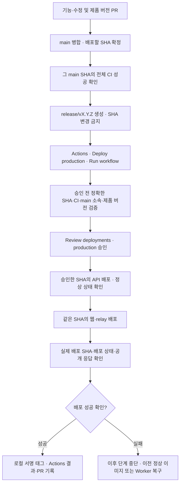

# 버전별 스냅샷과 GitHub 승인형 배포

전환 목표는 **검증한 main 커밋을 `release/vX.Y.Z`에 보존하고, GitHub Actions에서 승인한 뒤 배포하는 방식**이다. 버전별 브랜치는 배포할 SHA를 고정하는 스냅샷이며, 배포 시작은 GitHub의 수동 실행과 `production` 환경 승인이 담당한다. 고정 release에 개발 코드를 계속 병합하지 않으므로 `main → release` 배포 PR과 `release → main` 이력 동기화 PR은 필요 없어지고, 제품 변경과 버전 준비 PR은 계속 main을 대상으로 한다.

**2026-10-01 전환 준비 기록:** 기존 운영 제품 버전은 `0.0.4`이며, Openship의 API 자동 배포와 Cloudflare의 웹·relay 배포는 고정 release에 연결되어 있었다. GitHub 승인형을 선택하고 [배포 작업 파일](../.github/workflows/deploy.yml), production 승인 환경, 전용 SSH·프로젝트 한정 토큰을 준비했다. 로컬 CLI의 읽기 조회를 검증했으며 GitHub runner 접속·실제 배포·기존 자동 배포 중지는 후속 전환 단계다. 실제 전환 결과와 최초 배포 실행은 [전환 PR #16](https://github.com/mabyko/EnvHandoff/pull/16)에 기록한다.

## 단계별 전환

| 단계 | 준비할 내용 | 완료 확인 |
| --- | --- | --- |
| 1. 문서 | 브랜치 역할·검증·승인·복구·공개 범위 확정 | 이 문서와 배포 가이드 검토 |
| 2. CI | main·버전 브랜치의 정확한 SHA에 전체 테스트·빌드 실행 | 실제 main 병합 SHA의 전체 검증 성공 |
| 3. 보호 | 버전 브랜치 최초 생성 검사와 이후 변경 제한, production 승인 환경 준비 | 규칙·승인자·관리자 우회 금지 확인 |
| 4. 연동 준비 | 승인된 작업의 API·웹 배포, 전용 자격 증명·접속·복구 경로 준비 | 현재 운영을 유지하며 작업·접속 검증 |
| 5. 최종 전환 | 정상 배포 이력 보존, 독립 자동 배포 중지, 기존 release 정리, 최초 승인형 배포 | 실제 배포 SHA·운영 응답·성공 후 태그 확인 |

최종 전환 전에 보존할 ref·현재 정상 배포·배포할 SHA·자동 배포를 중지할 설정·복구 경로를 구체적으로 확인한다. 전용 배포 키와 토큰 준비는 이 단계에 포함되며 기존 자격 증명을 문서나 PR에 복사하지 않는다.

## 브랜치와 태그의 역할

| 브랜치 / 태그 | 역할 | 운영 배포를 시작하나? |
| --- | --- | --- |
| `feature/*`, `fix/*` | 기능·수정 작업 후 main에 PR | 아니요 |
| `main` | 검토한 코드와 제품 버전 변경을 모음 | 아니요 |
| `release/vX.Y.Z` | 전체 검증을 통과한 main SHA를 보존하는 스냅샷 | 생성 자체로는 아니요 |
| 서명 태그 `vX.Y.Z` | 성공을 확인한 실제 배포 SHA의 기록 | 태그 자체로는 아니요 |

main의 PR·필수 CI·최신 베이스 요구는 유지한다. 버전 브랜치는 생성 이후 커밋 추가·병합·강제 push를 하지 않는다. 수정은 main 대상 PR과 다음 버전 브랜치로 준비한다. [버전 보호 규칙](../.github/rulesets/versioned-releases.json)은 최초 생성에도 GitHub Actions의 필수 검사 성공을 요구하고 이후 업데이트·삭제·강제 push를 막는다. 2026-10-01 원격 `release/*` 규칙을 활성화하고 우회 권한 없음·생성 검사 강제·이후 변경 제한을 API 응답으로 확인했다. 기존 고정 release에는 영향을 주지 않는다. [GitHub 규칙](https://docs.github.com/en/repositories/configuring-branches-and-merges-in-your-repository/managing-rulesets/available-rules-for-rulesets)

## 전환 후 배포 흐름

아래 Mermaid는 선택한 목표다. 원격 설정과 최초 운영 실행을 검증하기 전에는 적용 완료로 간주하지 않는다.

API 정상 상태를 확인한 뒤 웹을 시작한다. 기존 서비스의 독립 자동 배포가 서로 기다리는 구조를 사용하지 않는다. 운영 배포는 직렬로 진행하고, 새 실행 때문에 진행 중인 배포를 취소하지 않는다.

## 실제 배포할 때

1. [버전 준비 PR 템플릿](../.github/PULL_REQUEST_TEMPLATE/release.md)을 사용해 main 대상 PR을 준비한다. 루트·웹·API·relay·protocol의 `package.json` 다섯 곳을 같은 제품 버전으로 올리고 변경 요약·호환성·DB 및 환경변수 변경·복구 계획을 기록한다.
2. PR 병합 뒤 **그 main SHA 자체의 전체 `pnpm check` 성공**을 확인한다. PR의 임시 병합 SHA에 대한 성공만으로 다른 SHA를 배포하지 않는다. 테스트는 전용 임시 PostgreSQL DB를 사용하고 운영 DB·배포 자격 증명에 접근하지 않는다.
3. 성공한 main SHA에서 `release/vX.Y.Z`를 생성한다. 최초 생성에도 검사를 요구하는 보호를 먼저 적용한다. main SHA의 CI 성공 → 그 SHA로 브랜치 생성 → 같은 SHA의 브랜치 CI·보호 상태 확인 순서다. 버전 브랜치로 추가 PR을 병합하지 않는다.
4. GitHub **Actions → Deploy production → Run workflow**에서 해당 `release/vX.Y.Z`를 선택해 실행한다. 추가 입력값은 없다. `Verify release` 작업이 승인 전에 SHA를 고정하고 main 소속·해당 SHA의 최신 main push CI 성공·전체 `pnpm check` 단계 성공·GitHub Actions의 검사 출처·브랜치 이름과 다섯 제품 버전의 일치를 확인한다. 실패하면 운영 승인·배포로 진행하지 않는다.
5. 실행 화면에서 검증 결과·정확한 SHA·변경 내용·복구 계획을 확인하고 **Review deployments → production → Approve and deploy**를 누른다. 혼자 운영하는 동안은 실행자가 직접 승인할 수 있다.
6. 승인된 `Deploy API then web` 작업이 API를 배포하고 정상 상태를 확인한 뒤 웹·relay를 배포한다. 승인 대기 중 main이 앞서가도 선택한 버전과 SHA는 바뀌지 않는다. Job Summary의 SHA·전체 CI 링크·API 및 Worker 배포 ID·Worker 버전·상태 확인 결과를 보고, 실행 링크와 배포 결과를 버전 준비 PR에 남긴다.
7. 운영 상태 확인 후 실제 배포 SHA에 로컬에서 서명 태그 `vX.Y.Z`를 만들고 push한다. 기존 서명 방식을 재사용하며 CI에 GPG 개인키를 넣지 않는다. 실패한 배포에 성공 태그를 붙이거나 기존 태그를 옮기지 않는다.

수동 실행은 배포 승인이 아니다. `Run workflow` 뒤의 `production` 승인까지 있어야 배포가 시작된다. [수동 실행](https://docs.github.com/en/actions/how-tos/manage-workflow-runs/manually-run-a-workflow)

## production 환경 보호

- 승인자를 지정하고, 혼자 운영하는 동안 `Prevent self-review`는 끈다(`prevent_self_review=false`). 관리자 보호 규칙 우회는 허용하지 않는다.
- 배포 브랜치는 `release/v*`로 제한한다. 브랜치 보호와 운영 승인은 각각 적용한다.
- 배포용 SSH 키·API 토큰·Cloudflare 토큰과 접속 설정은 `production` 환경의 secrets/variables에 보관한다. 비밀값을 사용하는 작업에 환경을 연결해 승인 이후에만 접근하게 한다. 승인 전 검증에는 배포 secrets를 제공하지 않는다.
- 검증과 실제 배포는 동일한 SHA를 사용한다. 실행 결과에는 버전·SHA·상태·배포 결과를 남기되 토큰·키·실제 설정 파일·운영 데이터는 출력하지 않는다.

2026-10-01 원격 production 환경에 승인자·실행자 직접 승인 허용·관리자 우회 금지·`release/v*` 브랜치 조건을 적용하고 응답을 확인했다. 승인 대기와 비밀값 접근 제한이 배포 작업에서 작동하는지는 최초 실행으로 확인해야 한다. [GitHub 환경 보호](https://docs.github.com/en/actions/how-tos/deploy/configure-and-manage-deployments/manage-environments)

## 기존 자동 배포와의 전환

선택한 방식에서는 배포마다 두 서비스의 소스 브랜치를 수동 전환하지 않는다. 승인된 작업이 Openship에 정확한 커밋의 API 배포를 요청하고, 같은 SHA에서 빌드한 웹·relay를 Wrangler로 배포한다. 설치된 Openship 버전의 커밋 지정 기능과 실행기의 관리 API 접속·인증은 운영 전환 전에 검증한다.

프로젝트 한정 토큰은 production 환경에 보관했다. 전용 SSH와 고정 버전 CLI로 대상 프로젝트·서비스·배포의 읽기 조회를 검증했고, 범위를 벗어난 관리 조회는 거부됨을 확인했다. 이 결과는 GitHub runner의 실제 배포 성공을 대신하지 않는다.

작업은 기존 PostgreSQL과 영속 스택을 유지하고 API 서비스만 배포한다. 현재 정상 API 배포 SHA와 후보 사이에 `compose.production.yaml` 또는 `apps/api/sql` 변경이 있으면 자동 배포를 중단한다. DB·Compose 변경은 별도로 검토한 적용·호환성·복구 절차를 준비해야 하며, 실패한 검사를 우회하거나 운영 데이터를 초기화하지 않는다.

**Openship Auto Deploy와 Cloudflare Workers Builds의 독립 브랜치 자동 배포는 전환 시 중지한다.** 기존 저장소 push 연결이 살아 있으면 GitHub 승인을 기다리지 않거나 같은 버전을 중복 배포할 수 있다. 설정 중지는 실행 중인 API·DB·Worker를 삭제하는 작업과 구분한다. 기존 Openship 저장소 연결·webhook을 불필요하게 다시 만들지 않는다.

현재 설치된 Openship의 브랜치 값 변경은 즉시 배포·webhook 교체·실행 중 컨테이너 변경을 하지 않는다. Cloudflare는 production branch 하나의 push로 빌드하며 별도의 저장 단계를 사용한다. 저장 직후 빌드 여부는 확인하지 않았다. 이 동작을 새 버전별 배포 승인 기능으로 간주하지 않는다. [Openship 자동 배포](https://openship.io/docs/guides/auto-deploy), [Cloudflare 빌드 브랜치](https://developers.cloudflare.com/workers/ci-cd/builds/build-branches/)

## 기존 release 정리와 최초 전환

Git에서는 `release`와 `release/v0.0.5`가 공존할 수 없다. 다음 준비를 마친 뒤 고정 release를 정리한다.

1. 현재 정상 release SHA·서명 태그·Openship 배포·API 이미지·Worker 버전과 복구 방법을 보존한다. 이전 SHA를 `release-legacy/v0.0.4`처럼 충돌하지 않는 ref에 남기고 서명 태그와 SHA 일치를 확인한다.
2. 선택한 main SHA의 전체 검증, versioned 보호 규칙, production 환경, 전용 자격 증명, 승인형 작업을 준비한다. 진행 중인 PR·배포·webhook 이벤트와 기존 자동 배포 중지 계획을 확인한다.
3. 로컬 release와 이를 사용하는 worktree를 확인한다. 필요한 이력과 작업은 충돌하지 않는 이름으로 보존하며 사용 중인 worktree나 변경을 무조건 삭제하지 않는다.
4. 기존 자동 배포를 중지하고 그 상태를 확인한 뒤 원격 release를 삭제한다. 각 체크아웃에서 `git fetch --prune origin`으로 오래된 `origin/release` 추적 ref를 정리한다. 남은 로컬 release와 추적 ref도 버전별 브랜치 생성·fetch의 접두사 충돌을 일으킬 수 있다.
5. 검증한 SHA로 버전 브랜치를 생성하고 같은 SHA의 CI·보호를 확인한다. 이후 앞의 Run workflow·운영 승인·배포 순서로 최초 배포를 검증한다.

버전 브랜치가 남아 있으면 고정 release를 다시 만드는 것도 접두사 충돌로 막힌다. 복구를 위해 버전 브랜치를 일괄 삭제하지 않는다. `release/v0.0.5`와 `release/v0.0.6`는 함께 보존할 수 있다.

## 배포 확인과 실패 복구

배포 요청 접수만으로 성공 처리하지 않는다. 작업은 API 배포의 커밋·브랜치·정상 상태와 무쿠키 `/auth/session`의 `401`, Worker의 SHA 태그·100% 반영 상태·relay `/api/health`·해당 SHA에서 빌드한 웹 asset 경로 일치를 확인한다. 공개 제품 버전·변경 화면과 기존 DB 상태도 운영 점검에 포함한다. 변경한 로그인·전달 기능은 범위에 맞춰 추가 검사한다.

한 단계가 실패하면 이후 배포를 중단하고 실제 상태부터 확인한다.

- **API:** 이전 정상 배포 ID·실제 이미지와 서비스 설정으로 복구한다. DB·영속 볼륨·삭제대장을 초기화하지 않는다.
- **웹·relay:** 이전 정상 Worker 버전으로 복구하고 공개 화면과 `/api/health`를 다시 확인한다.
- **DB 변경:** 배포 전에 이전 API 이미지가 변경된 스키마에서 실행 가능한지 검토한다. 불가능하면 자동으로 구버전 API를 실행하지 않고 준비한 수정 배포 또는 [데이터 복원 절차](operations.md#과거-백업에서-복원할-때)를 따른다. 코드 복구와 과거 DB 복원은 별개다.

전환 첫 배포도 기존 release를 재생성하기보다 보존한 실제 배포로 복구한다. 이 경로는 release 삭제 전에 확인한다. 웹·API가 서로 다른 정상 SHA를 사용하는 경우에는 실제 상태와 호환성을 기록한다. Actions 실행 링크·승인 SHA·실제 배포 SHA·각 배포 ID·확인 시각·서명 태그를 버전 준비 PR에 남긴다.

## 대안과 선택 이유

기존 자동 배포를 활용하면 초기 작업은 적지만 매번 두 서비스의 운영 소스를 전환하고 순서를 확인해야 한다. GitHub 승인형은 첫 인증·워크플로 설정이 필요하지만 SHA 검증·운영 승인·API 후 웹 배포를 한 실행 기록으로 남길 수 있어 이 방식을 선택했다.

고정 release를 유지하는 대안은 최신 release에서 `deploy/vX.Y.Z`를 만들고 main 커밋을 병합해 release 대상 PR을 여는 방식이다. 현재 전환 목표에는 사용하지 않는다.

## 공개 문서의 범위

브랜치 역할·검증 조건·승인·배포 순서는 공개할 수 있다. 배포 토큰·SSH 개인키·인증 쿠키·실제 설정 파일·운영 데이터·내부 관리 주소·계정 및 프로젝트 식별자를 문서나 PR에 추가하지 않는다. 환경 설정 이름만 문서화하고 값은 비밀 설정에 보관한다. Mermaid에는 공개 가능한 서비스명과 단계만 넣는다.
